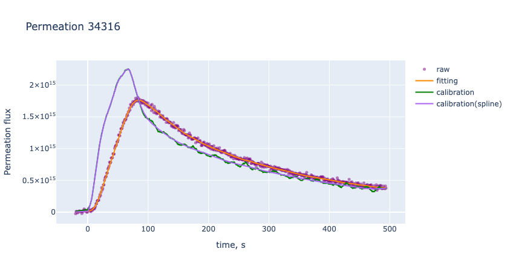

# 03_apply_calibration

## Overview
This step converts the ion current data obtained in `01_extract_shot` into permeation flux using the coefficients \(a\) and \(\tau\) calculated in `02_calc_pumping_time`.

\[
\Gamma_{pdp} = a \cdot \left( I - I_0 + \tau\frac{dI}{dt}\right)
\]

## Noise Reduction and Processing Flow
To minimize the impact of noise during the derivative calculation for pumping delay correction, a multi-stage processing pipeline is implemented. This is particularly crucial for short-duration discharge data where noise is prominent.

**Processing Order:**
1. **SMA** (Simple Moving Average)
2. **Savitzky-Golay Filter**
3. **TVRegDiff** (Total Variation Regularized Differentiation)
4. **Spline Fitting**
5. **Savitzky-Golay Filter** (Final smoothing)

## Considerations for Spline Fitting
- **Parameter Tuning:** Be aware that improper parameter settings can lead to significant deviations from the raw data.
- **Weighting:** Adjust the weights appropriately between the "during-discharge" and "after-discharge" phases.
- **Consistency Check:** Always compare the data before and after the spline application (`calibration` vs `calibration(spline)`) to ensure there are no unphysical artifacts or unnatural behaviors.

The parameters used for discharges **#34313–#34320** are directly recorded within the filenames located in the `data/calibrated/` directory.

